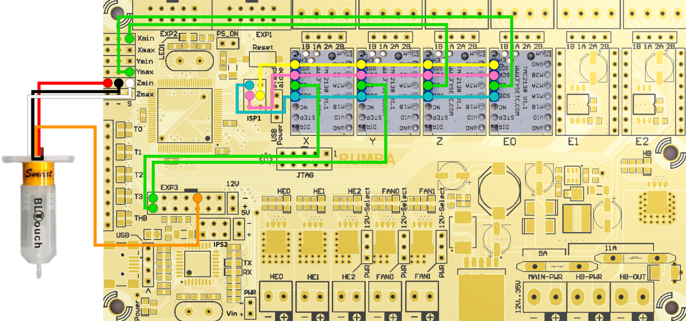

# Marlin 3D Printer Firmware
This is a fork from [Marlin Firmware](https://github.com/MarlinFirmware/Marlin).
Additional documentation can be found at the [Marlin Home Page](https://marlinfw.org/).

## Configuration for BigBox
This is a Marlin 2.0.9 configuration for a BigBox with BLTouch and TMC2130 drivers on X, Y, Z and E.

The wiring should follow this wiring diagram in order to work with this configuration. If your implementation is different please modify the pins_RUMBA.h file and/or configuration files.

## Responsability
Please review the firmware before installing it on your board. This is provided as a guideline but may not work with your printer.
I am not responsible for any damages or harm cause by the use of this firmware.

## License
Marlin is published under the [GPL license](/LICENSE) because we believe in open development. The GPL comes with both rights and obligations. Whether you use Marlin firmware as the driver for your open or closed-source product, you must keep Marlin open, and you must provide your compatible Marlin source code to end users upon request. The most straightforward way to comply with the Marlin license is to make a fork of Marlin on Github, perform your modifications, and direct users to your modified fork.

While we can't prevent the use of this code in products (3D printers, CNC, etc.) that are closed source or crippled by a patent, we would prefer that you choose another firmware or, better yet, make your own.